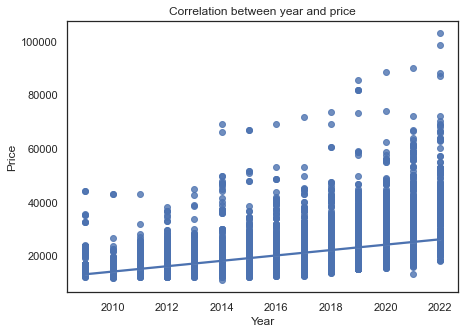
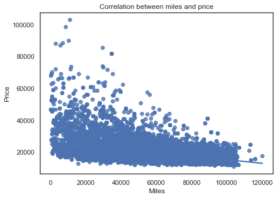
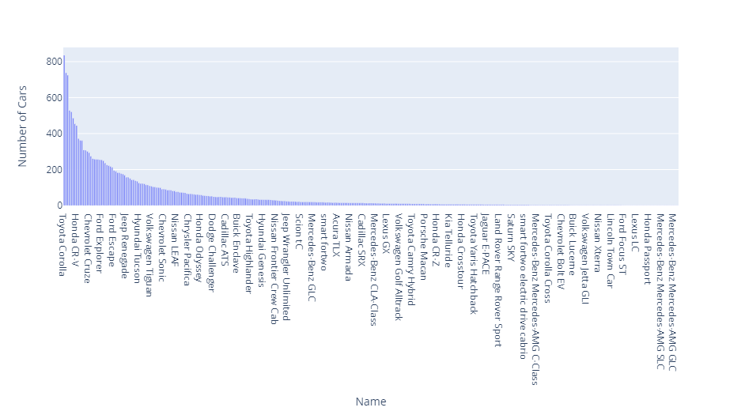

# Used Car Predtion Project

## Goal

This project aims to predict car prices using the cravana used car dataset found [here.](https://www.kaggle.com/datasets/ravishah1/carvana-predict-car-prices) 

# Overview

* Using Data, we want to predict the price of used cars in the currently declining car market. With used car Giants on the brink of bankruptcy we can used ML to capitalize on a volitile market.

# Business Understanding

WE are a up-and-coming used car company that is looking to capitalize on the current downfall of the car market. In order to make accurate car price predictions that can help the company travers this market we need to explore the following factors.

* Understanding the market- the online used car market is struggling post pandemic big companys are selling their inventory for a lower average price
* Utilizing Industry giants Inventory- The Dataset Utilizes Carvana's Used Car inventory to get a understanding of the state of the market from a company that has a sizable market share.
* We are going to use Machine learning to analyze and understand the inventory listed above to predict along with supporting data to predict prices.

# Data Understanding 

* The Data set used is the Carvana used car inventory  [here.](https://www.kaggle.com/datasets/ravishah1/carvana-predict-car-prices) 
* The dataset contained 4 columns I used 3 for analysis and prediction
* Contains over 20 thousand used cars
* Ranging from  1995 to 2022
* The average price of a car in their inventory is 20k
* The average amount of miles on their cars are 54k
* There are some older antic cars as well some new high-end cars We will not be focusing on those 

# Data Analysis
* There is a positive corelation between the year of the car and the price

* There is a negative corelation between the price of the car and the amount of miles it had

* The most popular cars in the inventory were mid-small size sedan such as Toyota Corolla and Honda CR-V

* The most popular model years in the inventory were 2015 and 2019 

# Model Prediction 

Three models were tested to find the most accurate one to use for prediction.
* Linear Regression had an error of 3000
* XB Boost had an error of 2500
* Decision Tree Regressor had the lowest amount error of around 1600

# Conclusion 

The model predicted that the company should spend 18500$ on a used car which is 1500$ below the average price. 
There is room for imporve especially in the dataset that will help contribtue to the accuracy of the model.
The dataset had year/miles/price/ make and model, variables such as mpg,fuel type, and interest rate would contribute to the accuracy.

# Navigating this Repository

The presentation about this project can be found [here.](https://github.com/meugene2022/AI-capstone/blob/main/AI_Capatone_Powerpoint.pdf) it contains a brief summary of the data and the prediction.

The final notebook can be found in the file can be found [here](https://github.com/meugene2022/AI-capstone/blob/main/Capstone%20Project%20Notebook.ipynb) contains the data exploration, cleaning and analysis that supported our final recommendations for used car Predction.

The data used in this analysis is located in the carvana dataset [here](https://github.com/meugene2022/AI-capstone/blob/main/carvana.csv)

